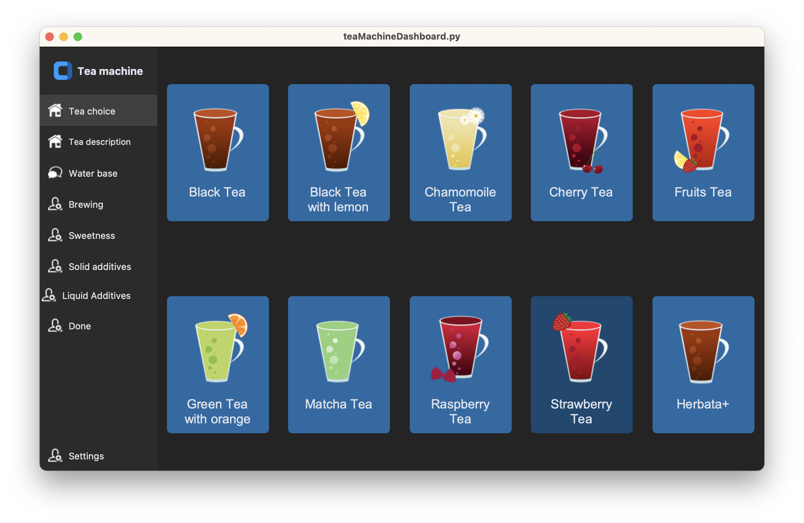

# Tea Machine Dashboard


A simple dashboard for controlling a tea machine, built using the `customtkinter` library. The app provides an interface for selecting different types of tea, water base, brewing options, sweetness level, solid and liquid additives, and other settings.

## Installation

### Prerequisites

- Python 3.x
- customtkinter
- PIL (Pillow)

Install the required packages using the following commands:

```bash
pip install customtkinter
pip install pillow
```

### Clone the Repository

```bash
git clone https://github.com/username/teaMachineDashboard.git
cd teaMachineDashboard
```

## Usage

Run the application with:

```bash
python teaMachineDashboard.py
```

## Features

- **Tea Choice**: Select from different types of tea like Black Tea, Cherry Tea, Green Tea, etc.
- **Water Base**: Customize the water base for your tea.
- **Brewing Options**: Control brewing settings.
- **Sweetness Level**: Adjust the sweetness of your tea.
- **Solid & Liquid Additives**: Add various solid and liquid additives.
- **Fullscreen Toggle**: Press the "Escape" key to toggle fullscreen mode.

## Customization

Images used for buttons and logos can be found in the "images" folder. Feel free to replace them with your own design.

